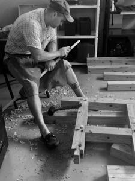
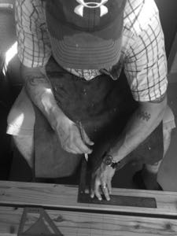
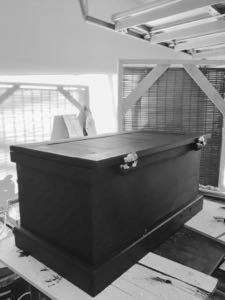
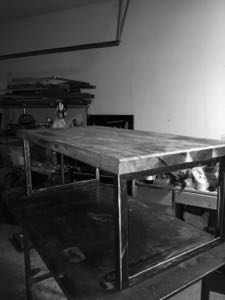

  
# **WOODWORKING**  

---  
## My name is John and I enjoy *building things!* Preferably, I use wood but sometimes I mix that with metal.  
### When I have an idea of something I would like to build, I do a rough sketch on paper to see how it will  
## look. Next I will use a drafting table with grid paper and a straight edge and measure out proper lengths  
### and widths of materials.  With the [***technology age***](https://en.wikipedia.org/wiki/Information_Age) taking grip on the world naturally an engineer would   
## develop software to make designing furniture a little more precise and easier in some circumstances.
---
 
## ***DESIGN***  
  
### THERE ARE TWO METHODS USED TO DESIGN:  
1. [Tradional](traditional.md)  
1. [Using CAD](usingcad.md)

