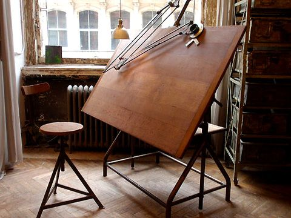
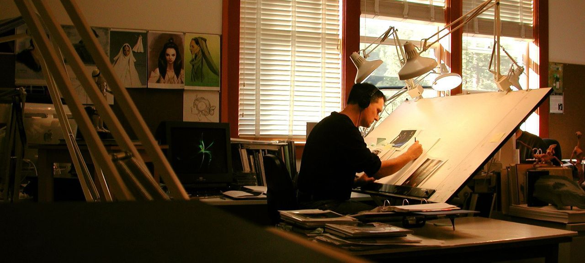

# *TRADITIONAL*  
## *Using a drafting table*  
  
## Tools required for this method:  
1. ***drafting table***
1. ***pencil***  
1. ***straight edge***  
  
### Estimate = $210.00  
### This is the method I use to do the initial design. I enjoy it because there is a certain nostalgia to working with  
a pencil and a straight edge. I prefer this method even though it does take a little more time to design, it reminds me to  
slow down. I am able to set the drafting table up in my shop and not stress that dust and debri will mess up the paper  
or have any effect on a machine loosing my drawings. Being able to set up in your shop puts all your projects in one  
central location.  
  
